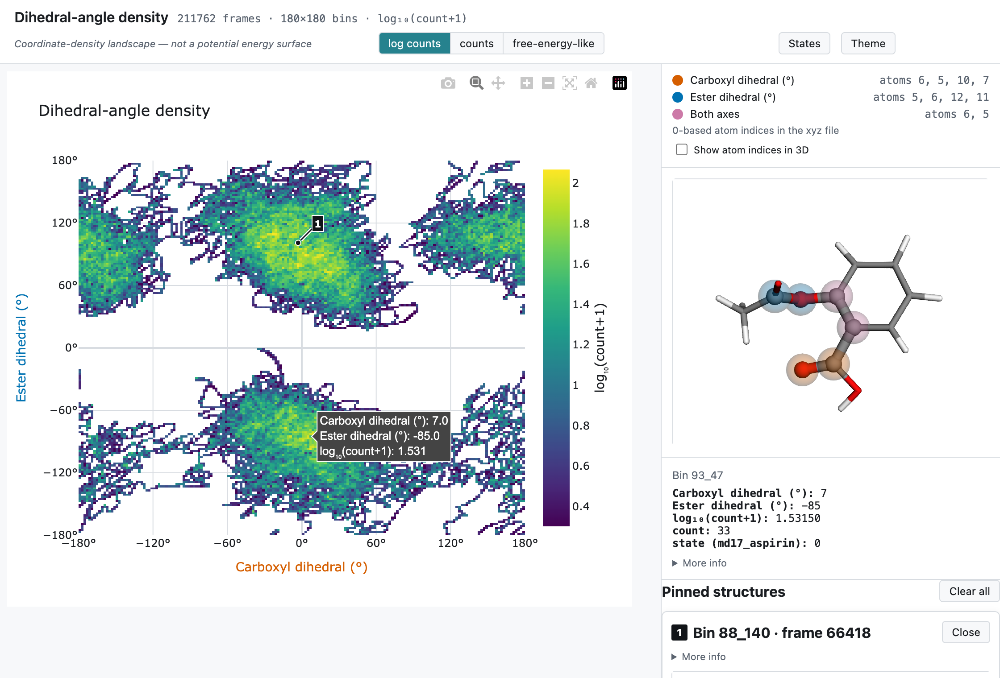

# ConfAna

[](https://github.com/AntonCh-G/ConfAna/actions/workflows/tests.yml)
[](LICENSE)

Conformer analysis for molecular trajectories. ConfAna reads multi-frame xyz files
(or a table of precomputed angles), computes carboxyl and ester angles for every frame,
and produces density maps, conformational states, state-to-state transitions, and
standalone interactive HTML pages with clickable 3D structures.

<a href="https://antonch-g.github.io/ConfAna/">
  <picture>
    <source media="(prefers-color-scheme: dark)" srcset="docs/images/viewer-dark.png">
    
  </picture>
</a>

## Install

Python 3.11+.

```bash
python -m venv .venv
source .venv/bin/activate
pip install -e .[dev]
```

## Demo

**[Open the live demo](https://antonch-g.github.io/ConfAna/)**, or download
[docs/demo/density_dihedral.html](docs/demo/density_dihedral.html) (8 MB; on GitHub, the
**Download raw file** button) and open it in any browser. It works offline.

It shows the public MD17 aspirin trajectory (211,762 frames). Hover the map to see structures,
and click a bin to pin one. On a phone, tap a bin to see its structure, then press **Pin**.
An iPhone's Files app previews the file without running it, so there it shows a picture of
the map; open the page from a web link, or in an app that runs web pages, to explore it.

## Quick start: MD17 aspirin

[MD17](http://www.sgdml.org/#datasets) is a public set of ab initio molecular dynamics
trajectories. Its aspirin trajectory has 211,762 time-ordered frames, 0.5 fs apart.

```bash
python scripts/md17_to_xyz.py                                  # download (193 MB) and convert to xyz
confana build-interactive --config examples/md17_aspirin.yaml
```

Result (about 10 seconds after the download):

```text
outputs/md17_aspirin/plots/density_dihedral.html   carboxyl vs ester dihedral
```

Open it in a browser. No server or internet needed. This is the page in `docs/demo/`.

The script checks the download against a fixed SHA-256 checksum and writes
`data/md17/md17_aspirin.xyz`. The `data/` folder is git-ignored, so the trajectory itself is
not in this repo. The demo page does embed 14,171 of its frames (one per map bin, coordinates
rounded to 0.001 Å); see [Data credit](#data-credit).

The key parts of [examples/md17_aspirin.yaml](examples/md17_aspirin.yaml):

```yaml
run_dir: outputs/md17_aspirin
data:
  path_pattern: ./data/md17/md17_aspirin.xyz

dof:                                       # angles to compute, 0-based atom indices
  - {name: carboxyl_dihedral, type: dihedral, atoms: [6, 5, 10, 7]}
  - {name: ester_dihedral,    type: dihedral, atoms: [5, 6, 12, 11]}

coordinate_pairs:                          # one density map + HTML page per pair
  - {name: dihedral, x: carboxyl_dihedral, y: ester_dihedral}

clustering:                                # states: one per region of the map (four)
  algorithm: grid
  default: {bin_size: 30.0, min_count: 800}
```

The config explains how these settings were chosen, and which nearby values give the
same four states.

## PIMD trajectories

For path-integral MD, give one xyz file per bead (for example `my_run.pos_00.xyz`,
`my_run.pos_01.xyz`, …). ConfAna reads the trajectory and bead IDs from the file names, with the
regular expressions `data.trajectory_id_pattern` and `data.bead_id_pattern`, and keeps beads separate
for clustering and transitions. A file the patterns give no ID for stops the run with an error.
PIMD runs stored as HDF5 (`data.format: hdf5`) are read too; see
[docs/configuration.md](docs/configuration.md#input-data). Start from
[examples/pimd_template.yaml](examples/pimd_template.yaml); no PIMD data ships with the repo.

## Using the interactive page

| Action | What happens |
|---|---|
| Hover a bin | 3D structure preview; side panel shows angles, count, state |
| Click "More info" | Full frame metadata: source file, frame number, byte offset, indices |
| Click a bin | Pins that frame as a numbered card and map marker |
| Esc or double-click | Clears all pins |
| Drag any 3D view | Rotates all views together |
| Header links | Switch pair pages; pins come along |
| Scale buttons | `log counts`, `counts`, or `free-energy-like` |

On a touch screen (phone or tablet):

| Action | What happens |
|---|---|
| Tap a bin | Previews it; the bin is outlined on the map |
| **Pin** (next to the values) | Pins the previewed frame; the button then shows its number |
| Swipe on the map | Scrolls the page; the map does not zoom |
| Tap a 3D view | Unlocks it for turning; **Done** or a tap elsewhere locks it again |
| **Clear all** | Clears all pins (a double tap does not) |

On a narrow screen the page is one scrolling column, and the scale and state controls
sit behind the **Controls** button.

Details: [docs/interactive-viewer.md](docs/interactive-viewer.md).

## Commands

| Command | Does |
|---|---|
| `confana extract-coordinates` | xyz → coordinate table (CSV) |
| `confana plot-densities` | density PNGs (300 dpi) |
| `confana cluster-states` | assigns a state to every frame |
| `confana compute-transitions` | transition counts and probabilities (rates if `dt` is set) |
| `confana build-interactive` | standalone HTML pages |
| `confana run-all` | all of the above |

All take `--config <file.yaml>`.

## Read the results correctly

- **Density, not energy.** Maps come from frame counts. "Free-energy-like" means
  `−kT·ln(population)`, not a potential energy surface.
- **Rates need time.** Physical rates appear only if `transitions.dt` is set.
  Barriers need both `dt` and `temperature`.
- **PIMD beads stay separate.** Transitions are computed per bead, then averaged.
- **State markers show one group.** `density_<pair>_states.png` marks each state at the
  mean of its frames' values (circular for dihedrals) for the first `clustering.groupby`
  group only, named in the title when there are several: labels are not shared between
  groups. The interactive page lets you pick the group.
- **Atom indices are 0-based file positions**, not chemical labels.

## Atom mapping (aspirin)

These indices follow the MD17 aspirin atom order.

| Coordinate | Atoms (0-based) |
|---|---|
| Ring plane (best fit, C1–C6) | `[0, 1, 2, 3, 5, 6]` |
| Carboxyl plane | `[9, 10, 7]` |
| Ester plane | `[12, 11, 8]` |
| Carboxyl dihedral | `[6, 5, 10, 7]` |
| Ester dihedral | `[5, 6, 12, 11]` |

## Tests

```bash
pytest                                              # all tests
python -m playwright install chromium --no-shell firefox   # once, for browser tests
```

## Data credit

The demo is built from the MD17 aspirin trajectory
([sgdml.org](http://www.sgdml.org/#datasets)), and the demo page contains a sample of its
frames. If you publish results made from it, cite:

> S. Chmiela, A. Tkatchenko, H. E. Sauceda, I. Poltavsky, K. T. Schütt, K.-R. Müller,
> "Machine learning of accurate energy-conserving molecular force fields",
> *Sci. Adv.* **3**, e1603015 (2017). https://doi.org/10.1126/sciadv.1603015

## More docs

- [docs/configuration.md](docs/configuration.md): every config section, rates and barriers
- [docs/interactive-viewer.md](docs/interactive-viewer.md): viewer behaviour and settings
- [docs/development.md](docs/development.md): code layout and testing
- [docs/adr/](docs/adr/): design decisions
